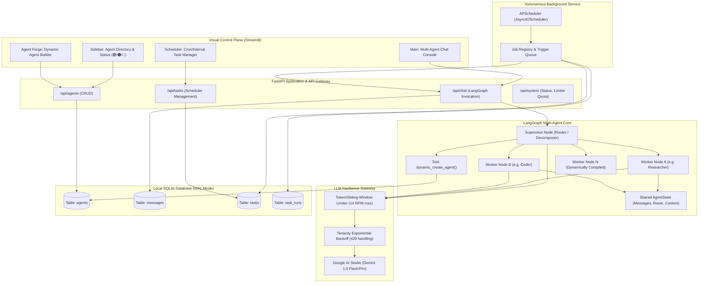
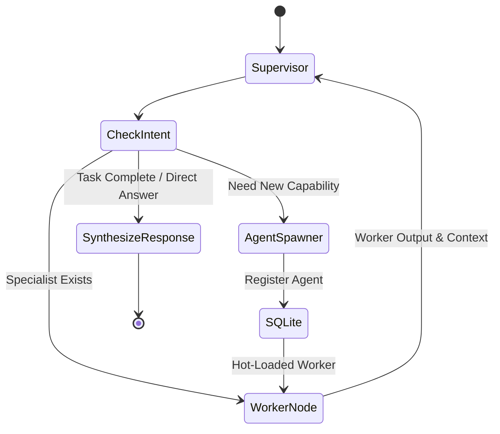

# System Architecture Document
## Project: Autonomous Multi-Agent System (MAS) & Visual Control Plane

### 1. High-Level Architecture

The system follows a modular, decoupled layered architecture comprising:
1. **Visual Control Plane (Streamlit Frontend)**
2. **API & Orchestration Layer (FastAPI Backend)**
3. **Multi-Agent Execution Engine (LangGraph)**
4. **Autonomous Scheduler Service (APScheduler / AsyncIO)**
5. **Resilient LLM Gateway (Gemini API with Rate-Limiting)**
6. **Local Persistence Engine (SQLite with WAL mode)**



---

### 2. Database Schema (SQLite)

The database file resides at `data/mas_database.db`. SQLite Write-Ahead Logging (`PRAGMA journal_mode=WAL;`) is activated on connection to support concurrent non-blocking reads and writes between the FastAPI backend, background scheduler, and Streamlit frontend.

```sql
-- 1. Agents Registry
CREATE TABLE IF NOT EXISTS agents (
    id TEXT PRIMARY KEY,                       -- UUID string
    name TEXT NOT NULL,                        -- Human-readable name (e.g., "Market Analyst")
    slug TEXT NOT NULL UNIQUE,                 -- Lowercase identifier (e.g., "market_analyst")
    role TEXT NOT NULL,                        -- Short description of agent responsibility
    system_prompt TEXT NOT NULL,               -- System prompt defining persona & constraints
    model TEXT NOT NULL DEFAULT 'gemini-1.5-flash', -- Underlying LLM model identifier
    status TEXT NOT NULL DEFAULT 'idle',       -- Status: 'idle' | 'running' | 'error'
    is_system_agent INTEGER NOT NULL DEFAULT 0,-- 1 for core supervisor, 0 for dynamic agents
    config_json TEXT DEFAULT '{}',             -- JSON encoded optional tool/tuning configurations
    created_at TIMESTAMP DEFAULT CURRENT_TIMESTAMP,
    updated_at TIMESTAMP DEFAULT CURRENT_TIMESTAMP
);

-- 2. Chat & Message History
CREATE TABLE IF NOT EXISTS messages (
    id TEXT PRIMARY KEY,                       -- UUID string
    session_id TEXT NOT NULL,                  -- Chat conversation or task run session ID
    sender_id TEXT NOT NULL,                   -- 'user', 'supervisor', or agent slug
    recipient_id TEXT DEFAULT 'all',           -- Target recipient or broadcast
    role TEXT NOT NULL,                        -- 'user' | 'assistant' | 'system' | 'tool'
    content TEXT NOT NULL,                     -- Message text or tool response
    metadata_json TEXT DEFAULT '{}',           -- JSON payload (token counts, delegation tags, tools called)
    created_at TIMESTAMP DEFAULT CURRENT_TIMESTAMP
);

-- 3. Autonomous Scheduled Tasks
CREATE TABLE IF NOT EXISTS tasks (
    id TEXT PRIMARY KEY,                       -- UUID string
    agent_id TEXT NOT NULL,                    -- Foreign key to agents.id
    name TEXT NOT NULL,                        -- Task title (e.g., "Daily Tech Briefing")
    prompt TEXT NOT NULL,                      -- Instructions/prompt passed to agent
    schedule_type TEXT NOT NULL,               -- 'cron' | 'interval' | 'one_shot'
    schedule_expr TEXT NOT NULL,               -- e.g., '0 9 * * *' or interval seconds '300'
    is_active INTEGER NOT NULL DEFAULT 1,      -- 1 = Enabled, 0 = Paused
    last_run_at TIMESTAMP,
    next_run_at TIMESTAMP,
    created_at TIMESTAMP DEFAULT CURRENT_TIMESTAMP,
    updated_at TIMESTAMP DEFAULT CURRENT_TIMESTAMP,
    FOREIGN KEY (agent_id) REFERENCES agents(id) ON DELETE CASCADE
);

-- 4. Autonomous Task Run Executions
CREATE TABLE IF NOT EXISTS task_runs (
    id TEXT PRIMARY KEY,                       -- UUID string
    task_id TEXT NOT NULL,                     -- Foreign key to tasks.id
    agent_id TEXT NOT NULL,                    -- Target agent executing task
    status TEXT NOT NULL,                      -- 'running' | 'success' | 'failed'
    input_prompt TEXT NOT NULL,
    output_result TEXT,                        -- Agent generated final response
    error_message TEXT,                        -- Error stack trace if failed
    started_at TIMESTAMP DEFAULT CURRENT_TIMESTAMP,
    completed_at TIMESTAMP,
    FOREIGN KEY (task_id) REFERENCES tasks(id) ON DELETE CASCADE,
    FOREIGN KEY (agent_id) REFERENCES agents(id) ON DELETE CASCADE
);

-- Indexes for performance
CREATE INDEX IF NOT EXISTS idx_messages_session ON messages(session_id);
CREATE INDEX IF NOT EXISTS idx_agents_slug ON agents(slug);
CREATE INDEX IF NOT EXISTS idx_tasks_agent ON tasks(agent_id);
CREATE INDEX IF NOT EXISTS idx_task_runs_task ON task_runs(task_id);
```

---

### 3. LangGraph Multi-Agent Architecture

#### 3.1. State Definition
The LangGraph workflow utilizes an extensible `AgentState` TypedDict:

```python
from typing import Annotated, Sequence, TypedDict, Literal
from langchain_core.messages import BaseMessage
import operator

class AgentState(TypedDict):
    messages: Annotated[Sequence[BaseMessage], operator.add]
    next: str                                 # The next node to execute ('FINISH' or worker slug)
    session_id: str
    active_agent: str                         # Currently executing agent
    delegation_chain: list[str]               # Audit trail of delegation steps
    supervisor_scratchpad: str                # Internal decomposition plan
    error: str | None                         # Error message if step failed
```

#### 3.2. Supervisor Routing Logic
1. **Dynamic Registry Loading:** Upon each invocation, the Supervisor node queries the SQLite `agents` table to retrieve all active worker agents and their role descriptions.
2. **Routing / Structured Decision:** The Supervisor utilizes Gemini with Structured Outputs / Function Calling to decide one of three paths:
   - **`DIRECT_ANSWER` (`FINISH`)**: The Supervisor directly answers the query (e.g. conversational greetings or synthesizing previously gathered worker answers).
   - **`DELEGATE` (`worker_<slug>`)**: Routes execution to an existing registered worker agent.
   - **`SPAWN_AND_DELEGATE` (`create_agent_tool`)**: Detects missing expertise, generates new agent specifications, writes to SQLite, hot-reloads the graph router, and immediately dispatches the task to the newly minted agent.
3. **Cyclic or Terminating Workflow:**
   - Worker agents receive the task with context, execute their reasoning, append their response to `messages`, and return control to the `Supervisor` node.
   - The Supervisor either delegates the next step or marks `next = "FINISH"`.



---

### 4. Resilient LLM Gateway (Gemini 15 RPM Protocol)

Free-tier Google AI Studio API keys strictly enforce a **15 Requests Per Minute (RPM)** rate limit. To guarantee 100% operational resilience:

1. **Client-Side Sliding Window Limiter:**
   - Enforces a threshold of 14 requests per 60 seconds rolling window.
   - Tracks timestamps of all outbound calls in an in-memory thread-safe deque.
   - If the window count reaches 14, incoming calls are asynchronously queued (`asyncio.sleep`) until the oldest call in the window expires.
2. **Exponential Backoff via Tenacity:**
   - Wraps all LLM invocations with retry logic for `GoogleAPIError`, `ResourceExhausted` (HTTP 429), and connection timeouts:
   - Retry formula: `wait_exponential(multiplier=2, min=5, max=60) + wait_random(0, 2)`.
   - Max retry attempts: 5.
3. **Visual Indicator Synchronization:**
   - When an agent is waiting for a rate-limit slot, its status in the database is set to `cooling_down` (🟠 with rate-limit badge) so the user dashboard displays transparency into the queue.

---

### 5. Autonomous Background Scheduler (APScheduler)

- **Engine:** `AsyncIOScheduler` running as a background service inside the FastAPI application lifecycle (`lifespan` handler).
- **Triggers Supported:**
  - **Cron Trigger:** Standard cron syntax (e.g., `0 8 * * 1-5` for weekdays at 8 AM).
  - **Interval Trigger:** Interval in seconds or minutes (e.g., every 300 seconds).
  - **One-Shot Trigger:** Specific date/time execution.
- **Execution Flow:**
  1. Trigger fires in background asyncio loop.
  2. Scheduler fetches the target `agent_id` and `prompt` from the `tasks` table.
  3. Records a `task_runs` entry with status `running`.
  4. Updates agent status to `running`.
  5. Invokes the agent via LangGraph runner.
  6. Captures response, persists output to `task_runs` and `messages`, sets status to `idle`.
  7. Updates `last_run_at` and `next_run_at` on the task.

---

### 6. API Contracts (FastAPI Endpoints)

| Method | Endpoint | Description | Payload / Query | Response |
|:---|:---|:---|:---|:---|
| `GET` | `/api/agents` | List all registered agents | None | `List[AgentResponse]` |
| `POST` | `/api/agents` | Create new agent manually | `AgentCreateSchema` | `AgentResponse` |
| `GET` | `/api/agents/{id}` | Get agent details | None | `AgentResponse` |
| `PUT` | `/api/agents/{id}` | Update agent (prompt, name) | `AgentUpdateSchema` | `AgentResponse` |
| `DELETE` | `/api/agents/{id}` | Remove dynamic agent | None | `{"status": "deleted"}` |
| `POST` | `/api/chat` | Send message to agent/MAS | `ChatRequestSchema` | `ChatResponseSchema` |
| `GET` | `/api/chat/history/{session_id}`| Get session messages | None | `List[MessageSchema]` |
| `GET` | `/api/tasks` | List all scheduled tasks | None | `List[TaskResponse]` |
| `POST` | `/api/tasks` | Create new scheduled task | `TaskCreateSchema` | `TaskResponse` |
| `POST` | `/api/tasks/{id}/run` | Manually trigger task now | None | `TaskRunResponse` |
| `DELETE` | `/api/tasks/{id}` | Delete scheduled task | None | `{"status": "deleted"}` |
| `GET` | `/api/system/status` | Get rate limiter & agent health | None | `SystemStatusResponse` |

---

### 7. Directory Structure & Antigravity / Gemini Configuration

The project implements the Antigravity & Gemini Project Configuration Standard, adapted from hierarchical AI agent conventions:

| Claude Convention (Reference) | Antigravity & Gemini Equivalent | Purpose & Role |
| :--- | :--- | :--- |
| `CLAUDE.md` / `CLAUDE.local.md` | **`GEMINI.md`** | Root context loaded at session start; defines architecture, tech stack & rules. |
| `.mcp.json` | **`mcp_config.json`** / **`.agents/mcp_config.json`** | MCP server configurations (e.g., SQLite DB explorer, tool servers). |
| `.claude/settings.json` | **`.agents/settings.json`** | Model preferences, temperature, permissions, and tool guardrails. |
| `.claude/rules/` | **`.agents/rules/*.md`** | Modular topic-based rules (`code-style.md`, `testing.md`, `rate-limiting.md`). |
| `.claude/commands/` | **`.agents/workflows/*.md`** | Executable workflows & slash commands (`review.md`, `fix-issue.md`). |
| `.claude/skills/` | **`.agents/skills/<name>/SKILL.md`** | Progressive disclosure on-demand runbooks (e.g., `deploy/SKILL.md`). |
| `.claude/agents/` | **`.agents/subagents/*.md`** | Specialized subagents (`code-reviewer.md`, `security-auditor.md`). |
| `.claude/hooks/` | **`.agents/hooks.json`** & **`.agents/hooks/*.sh`** | Pre/Post tool lifecycle hooks (e.g., `validate-bash.sh`). |

```
bots-agents/
├── GEMINI.md                 # Root context loaded at session start
├── mcp_config.json           # Root MCP tool integration config
├── .github/
│   └── workflows/            # GitHub Actions CI/CD automation pipelines
│       ├── ci.yml            # Automated test suite, flake8 lint, secret scanner
│       ├── deploy-staging.yml# Staging deployment pipeline
│       └── deploy-prod.yml   # Production deployment pipeline
├── .agents/                  # Antigravity project customization root
│   ├── settings.json         # Model parameters, permissions, guardrails
│   ├── mcp_config.json       # Workspace MCP servers configuration
│   ├── rules/                # Modular hierarchical rules
│   │   ├── code-style.md     # Strict typing & layered architecture
│   │   ├── testing.md        # Pytest & mock protocols
│   │   ├── api-conventions.md# REST API standards & RFC 7807 errors
│   │   └── rate-limiting.md  # Gemini 15 RPM guardrails & backoff
│   ├── workflows/            # Repeatable multi-step workflows
│   │   ├── review.md         # Code review and audit workflow
│   │   └── fix-issue.md      # Bug diagnosis and repair workflow
│   ├── skills/               # On-demand progressive skills
│   │   └── deploy/
│   │       └── SKILL.md      # Deployment runbook for Docker & Cloud
│   ├── subagents/            # Specialized sub-agent personas
│   │   ├── code-reviewer.md  # Code quality reviewer subagent
│   │   └── security-auditor.md# Security & injection auditor subagent
│   ├── hooks.json            # Lifecycle hooks event definition
│   └── hooks/
│       └── validate-bash.sh  # PreToolUse shell command safety validator
├── docs/
│   ├── PRD.md
│   ├── ARCHITECTURE.md
│   ├── CODING_STANDARDS.md
│   └── DEPLOYMENT.md         # Docker, Cloud Run & CI/CD Deployment Guide
├── data/
│   └── mas_database.db       # Local SQLite store (persisted via Docker volume)
├── backend/
│   ├── Dockerfile            # Container image for FastAPI & LangGraph engine
│   ├── __init__.py
│   ├── main.py               # FastAPI application entrypoint & lifespan
│   ├── core/
│   │   ├── config.py         # App settings & Gemini API keys (pydantic-settings)
│   │   ├── database.py       # SQLite connection manager & WAL configuration
│   │   ├── rate_limiter.py   # 15 RPM sliding-window rate limiter
│   │   └── llm_gateway.py    # Resilient Gemini wrapper with Tenacity
│   ├── models/               # Pydantic domain models & schemas
│   │   ├── agent.py
│   │   ├── message.py
│   │   └── task.py
│   ├── repositories/         # SQLite data access layer (CRUD)
│   │   ├── agent_repository.py
│   │   ├── message_repository.py
│   │   └── task_repository.py
│   ├── services/             # Core business & multi-agent logic
│   │   ├── agent_service.py
│   │   ├── chat_service.py
│   │   ├── scheduler_service.py
│   │   └── langgraph_engine/
│   │       ├── state.py
│   │       ├── supervisor.py
│   │       ├── dynamic_worker.py
│   │       └── graph_builder.py
│   └── api/                  # FastAPI routers
│       ├── routes_agents.py
│       ├── routes_chat.py
│       ├── routes_tasks.py
│       └── routes_system.py
├── frontend/
│   ├── Dockerfile            # Container image for Streamlit dashboard
│   ├── app.py                # Streamlit main entrypoint
│   ├── components/
│   │   ├── sidebar.py        # Agent live status & system quota
│   │   ├── chat_view.py      # Multi-agent chat interface
│   │   ├── scheduler_view.py # Task management & logs
│   │   └── agent_forge.py    # Agent creation & prompt editor
│   └── utils/
│       └── api_client.py     # Frontend HTTP client interacting with FastAPI
├── scripts/                  # DevOps automation & security tooling
│   ├── validate_secrets.py   # Pre-flight secret leak detection scanner
│   ├── deploy_staging.sh     # Automated staging deployment script
│   └── deploy_prod.sh        # Automated production deployment script
├── tests/                    # 17 Unit, integration, and E2E pipeline tests
│   ├── test_rate_limiter.py
│   ├── test_database.py
│   ├── test_repositories.py
│   ├── test_supervisor.py
│   ├── test_scheduler.py
│   ├── test_api.py
│   ├── test_frontend_client.py
│   ├── test_e2e_persistence.py
│   └── test_e2e_pipeline.py
├── docker-compose.yml        # Local multi-container orchestration with persistent volume
├── .env.example              # Development environment template
├── .env.staging.example      # Staging environment template
├── .env.production.example   # Production environment template
├── pytest.ini
├── requirements.txt
└── run_tests.py              # Test suite orchestrator
```


