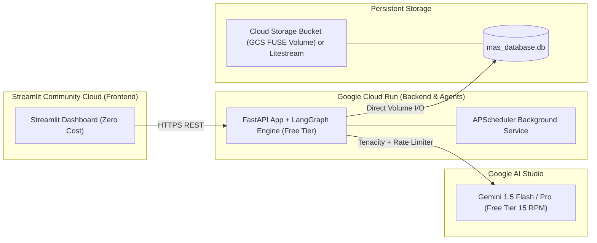
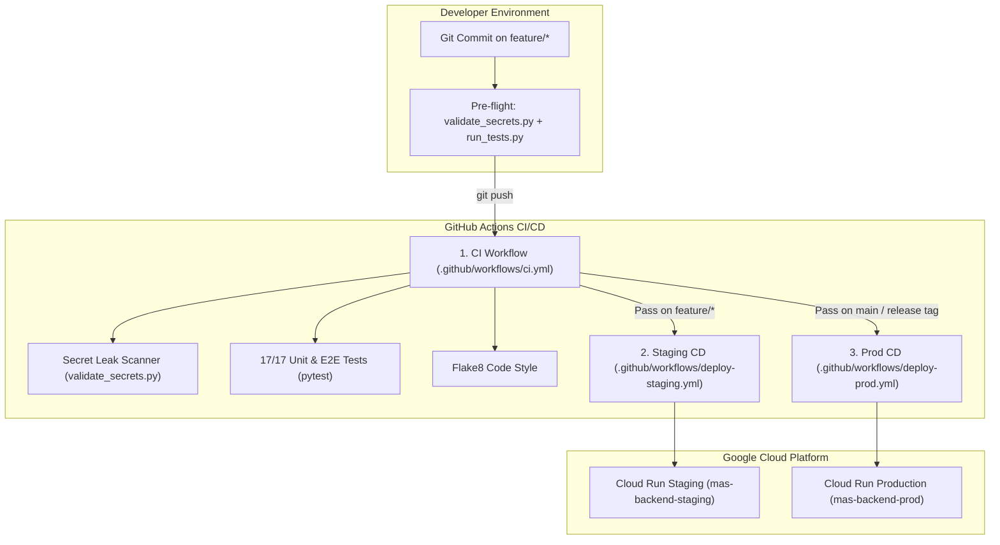

# Infrastructure & Deployment Strategy
## Project: Autonomous Multi-Agent System (MAS) & Visual Control Plane

### 1. Zero-Cost Production Topology Overview

The system is architected for zero-cost, enterprise-grade cloud hosting utilizing free-tier allowances without running costly persistent virtual machines:



#### Cost Profile
- **Google Cloud Run (Backend)**: Free Tier includes 2 million requests/month, 360,000 vCPU-seconds, and 180,000 GiB-seconds memory. Configured with `--min-instances=0` (or `1` during active scheduling) and `--memory=1Gi`.
- **Streamlit Community Cloud (Frontend)**: 100% Free public hosting directly connected to GitHub repository.
- **Google Cloud Storage (SQLite Persistence)**: Free Tier includes 5 GB standard storage per month. Mounted as a Cloud Run Second Gen volume via Cloud Storage FUSE, giving the SQLite database atomic persistence across container revisions and cold starts.
- **Google AI Studio**: Free-tier Gemini 1.5 Flash API keys (15 RPM).

---

### 2. Local Docker & Docker Compose Specification

#### 2.1. Backend Container (`backend/Dockerfile`)
```dockerfile
# Multi-stage lean Python 3.11 build
FROM python:3.11-slim as base

# Prevent Python from writing .pyc files and enable unbuffered logging
ENV PYTHONDONTWRITEBYTECODE=1 \
    PYTHONUNBUFFERED=1 \
    PYTHONPATH=/app

WORKDIR /app

# Install system dependencies (sqlite3, curl for health checks)
RUN apt-get update && apt-get install -y --no-install-recommends \
    sqlite3 \
    curl \
    && rm -rf /var/lib/apt/lists/*

# Copy dependency manifest
COPY requirements.txt .
RUN pip install --no-cache-dir --upgrade pip && \
    pip install --no-cache-dir -r requirements.txt

# Copy backend source code and initial data directory
COPY backend/ ./backend/
RUN mkdir -p /app/data

# Expose FastAPI port
EXPOSE 8000

# Healthcheck
HEALTHCHECK --interval=30s --timeout=5s --start-period=5s --retries=3 \
    CMD curl -f http://localhost:8000/api/system/status || exit 1

CMD ["uvicorn", "backend.main:app", "--host", "0.0.0.0", "--port", "8000"]
```

#### 2.2. Frontend Container (`frontend/Dockerfile`)
```dockerfile
FROM python:3.11-slim

ENV PYTHONDONTWRITEBYTECODE=1 \
    PYTHONUNBUFFERED=1 \
    STREAMLIT_SERVER_PORT=8501 \
    STREAMLIT_SERVER_ADDRESS=0.0.0.0 \
    STREAMLIT_SERVER_HEADLESS=true

WORKDIR /app

RUN apt-get update && apt-get install -y --no-install-recommends \
    curl \
    && rm -rf /var/lib/apt/lists/*

COPY requirements.txt .
RUN pip install --no-cache-dir --upgrade pip && \
    pip install --no-cache-dir streamlit httpx pydantic

COPY frontend/ ./frontend/

EXPOSE 8501

HEALTHCHECK --interval=30s --timeout=5s --start-period=5s --retries=3 \
    CMD curl -f http://localhost:8501/_stcore/health || exit 1

CMD ["streamlit", "run", "frontend/app.py", "--server.port=8501", "--server.address=0.0.0.0"]
```

#### 2.3. Local Orchestration (`docker-compose.yml`)
```yaml
version: '3.8'

services:
  backend:
    build:
      context: .
      dockerfile: backend/Dockerfile
    container_name: mas_backend
    ports:
      - "8000:8000"
    environment:
      - GEMINI_API_KEY=${GEMINI_API_KEY}
      - DATABASE_PATH=/app/data/mas_database.db
      - ENVIRONMENT=development
      - LOG_LEVEL=INFO
      - CORS_ORIGINS=http://localhost:8501,http://frontend:8501
    volumes:
      # Persistent named volume for SQLite database and task logs
      - mas_sqlite_data:/app/data
      # Bind mount code for hot reloading during development
      - ./backend:/app/backend
    restart: unless-stopped
    networks:
      - mas_network

  frontend:
    build:
      context: .
      dockerfile: frontend/Dockerfile
    container_name: mas_frontend
    ports:
      - "8501:8501"
    environment:
      - BACKEND_API_URL=http://backend:8000
    depends_on:
      backend:
        condition: service_healthy
    volumes:
      - ./frontend:/app/frontend
    restart: unless-stopped
    networks:
      - mas_network

volumes:
  mas_sqlite_data:
    name: mas_sqlite_data
    driver: local

networks:
  mas_network:
    name: mas_network
    driver: bridge
```

---

### 3. Persistent Storage Strategy for SQLite

SQLite requires atomic filesystem locking. To avoid database loss during container restarts and redeployments:

1. **Local Development (Docker Compose)**:
   - Configured with a dedicated named volume `mas_sqlite_data` mounted to `/app/data`.
   - Data persists across `docker-compose down` and `docker-compose up`.
2. **Google Cloud Run (Production)**:
   - **Method A (Cloud Storage Volume Mount - Recommended)**:
     - Cloud Run supports mounting a Google Cloud Storage (GCS) bucket directly as a filesystem directory via Cloud Storage FUSE.
     - Deploy with: `--add-volume=name=db-storage,type=cloud-storage,bucket=YOUR_GCS_BUCKET --add-volume-mount=volume=db-storage,mount-path=/app/data`.
   - **Method B (Litestream Continuous Replication - Alternative Zero-Cost Option)**:
     - Runs a lightweight background daemon inside the container that streams SQLite WAL changes to a free GCS bucket in real-time and restores the database on container initialization.

---

### 4. Environment Variables & Secret Management

#### 4.1. `.env.example` Template
```ini
# ==============================================================================
# Autonomous Multi-Agent System (MAS) Environment Configuration
# ==============================================================================

# LLM Provider Configuration
GEMINI_API_KEY=your_google_ai_studio_api_key_here
GEMINI_MODEL_DEFAULT=gemini-1.5-flash

# Backend & Database Configuration
ENVIRONMENT=development
PORT=8000
DATABASE_PATH=data/mas_database.db
LOG_LEVEL=INFO
CORS_ORIGINS=http://localhost:8501,http://localhost:3000

# Rate Limiter Guardrails (Google AI Studio Free Tier is 15 RPM)
MAX_RPM_LIMIT=14
RATE_LIMIT_WINDOW_SECONDS=60

# Frontend Configuration
BACKEND_API_URL=http://localhost:8000
STREAMLIT_SERVER_PORT=8501
```

#### 4.2. Secret Security Rules
- `.env` and `data/*.db` are strictly listed in `.gitignore`.
- On Cloud Run: Inject `GEMINI_API_KEY` via Google Secret Manager or direct environment variables.
- On Streamlit Cloud: Configure `BACKEND_API_URL` under **App Settings > Secrets**.

---

### 5. Step-by-Step Zero-Cost Deployment Guide

#### Step 5.1: Local Orchestration with Docker
1. Clone the repository and configure `.env`:
   ```bash
   cp .env.example .env
   # Edit .env and set GEMINI_API_KEY
   ```
2. Build and launch with Docker Compose:
   ```bash
   docker compose up --build -d
   ```
3. Verify running containers:
   - FastAPI API: `http://localhost:8000/docs`
   - Streamlit Dashboard: `http://localhost:8501`
4. Inspect database persistence:
   ```bash
   docker compose exec backend sqlite3 /app/data/mas_database.db "SELECT * FROM agents;"
   ```

#### Step 5.2: Deploying FastAPI Backend to Google Cloud Run
1. Authenticate with Google Cloud SDK:
   ```bash
   gcloud auth login
   gcloud config set project YOUR_GCP_PROJECT_ID
   ```
2. Create a persistent GCS bucket for SQLite data (free tier 5GB):
   ```bash
   gcloud storage buckets create gs://mas-data-YOUR_PROJECT_ID --location=us-central1
   ```
3. Build and push the backend container to Google Artifact Registry:
   ```bash
   gcloud builds submit --tag gcr.io/YOUR_GCP_PROJECT_ID/mas-backend -f backend/Dockerfile .
   ```
4. Deploy to Cloud Run with GCS volume mount:
   ```bash
   gcloud run deploy mas-backend \
     --image gcr.io/YOUR_GCP_PROJECT_ID/mas-backend \
     --platform managed \
     --region us-central1 \
     --allow-unauthenticated \
     --set-env-vars="GEMINI_API_KEY=YOUR_KEY,DATABASE_PATH=/app/data/mas_database.db,MAX_RPM_LIMIT=14" \
     --execution-environment gen2 \
     --add-volume=name=sqlite-vol,type=cloud-storage,bucket=mas-data-YOUR_PROJECT_ID \
     --add-volume-mount=volume=sqlite-vol,mount-path=/app/data
   ```
5. Capture your deployed backend URL: `https://mas-backend-xyz.a.run.app`.

#### Step 5.3: Deploying Frontend to Streamlit Community Cloud
1. Push your repository to GitHub (main branch or dedicated branch).
2. Go to [share.streamlit.io](https://share.streamlit.io/) and create a new application.
3. Select your repository, set the App path to `frontend/app.py`.
4. Under **Advanced Settings -> Secrets**, add:
   ```toml
   BACKEND_API_URL = "https://mas-backend-xyz.a.run.app"
   ```
5. Click **Deploy**. Your visual MAS control plane is live with zero monthly hosting cost.

---

### 6. Automated CI/CD Pipelines & Remote DevOps Infrastructure

To ensure enterprise-grade software delivery and zero credential exposure, the project integrates an automated **GitHub Actions CI/CD pipeline** with multi-stage environment promotion:



#### 6.1. GitHub Actions Workflows

1. **Continuous Integration (`.github/workflows/ci.yml`)**:
   - **Triggers**: Every `push` and `pull_request` targeting `main` or `feature/*`.
   - **Pre-Flight Secret Scan**: Executes `python3 scripts/validate_secrets.py` to intercept leaked API keys, tokens, or credential files before any tests run.
   - **Static Analysis**: Runs `flake8` to enforce PEP 8 standards.
   - **Full Test Suite**: Executes `run_tests.py` verifying all 17 unit, integration, and E2E pipeline tests.
   - **Artifact Upload**: Generates and uploads code coverage reports.

2. **Continuous Deployment: Staging (`.github/workflows/deploy-staging.yml`)**:
   - **Triggers**: Automatic push to `feature/*` or manual `workflow_dispatch`.
   - **Environment**: GitHub Environment `staging`.
   - **Build & Push**: Builds `backend/Dockerfile` with Google Cloud Build and tags as `gcr.io/$GCP_PROJECT_ID/mas-backend-staging:${{ github.sha }}`.
   - **Cloud Run Deployment**: Deploys to `mas-backend-staging` with staging environment variables and GCS volume mount.
   - **Automated Health Probe**: Validates `/api/system/status` on the deployed staging instance.

3. **Continuous Deployment: Production (`.github/workflows/deploy-prod.yml`)**:
   - **Triggers**: Release tags (`v*.*.*`) or merged PRs to `main`.
   - **Environment**: GitHub Environment `production` (with manual approval protection rules).
   - **Build & Push**: Tags container image with release version and `latest`.
   - **Zero-Downtime Rollout**: Cloud Run performs blue/green revision switching once health checks pass.

#### 6.2. Automated Shell Deployment Scripts

For manual or local CLI triggers, automated shell scripts mirror the CI/CD pipeline with pre-flight safety checks:

- **`scripts/validate_secrets.py`**:
  - Scans tracked and workspace files for Google AI Studio keys (`AIzaSy...`), GCP Service Account keys, private keys (`BEGIN PRIVATE KEY`), and dangerous uncommitted `.env` files.
  - Returns exit code `1` upon any detection to immediately halt build pipelines.
- **`scripts/deploy_staging.sh`**:
  - Loads `.env.staging` (or prompts for credentials).
  - Executes `scripts/validate_secrets.py` and `run_tests.py` prior to build.
  - Submits container build and deploys to Cloud Run staging service.
- **`scripts/deploy_prod.sh`**:
  - Enforces confirmation prompts before deploying to production.
  - Runs all safety audits and deploys to `mas-backend-prod`.

#### 6.3. Secret Storage & Isolation Strategy Per Environment (`test` / `stage` / `prod`)

To prevent credential leaks and ensure zero disruption between testing and production, secrets and sensitive configurations are strictly separated across three environments:

| Environment | Purpose | Where Secrets Are Stored | How They Are Accessed at Runtime | Live Gemini API Key? |
| :--- | :--- | :--- | :--- | :---: |
| **`test`** (Local & CI) | Unit tests, PR verification, linting, regression testing | • Local: `.env` (gitignored)<br>• GitHub Actions CI: In-memory runner environment | Injected as environment variables (`mock_dev_key`); tests run against SQLite `:memory:` or temporary databases | ❌ **No** (Hermetic mock mode, zero quota burn) |
| **`stage`** (Staging) | Pre-production testing, live API integration, user acceptance | • GitHub: **Environment Secrets (`staging`)**<br>• GCP: **Google Cloud Secret Manager**<br>• UI: **Streamlit Cloud Secrets** | Cloud Run mounts secrets via IAM service account (`--set-secrets`); Streamlit reads via TOML |  **Yes** (Dedicated Staging Gemini Key) |
| **`prod`** (Production) | Live end-user traffic, high-reliability operation | • GitHub: **Environment Secrets (`production`)** *(protected with approval rules)*<br>• GCP: **Google Cloud Secret Manager**<br>• UI: **Streamlit Cloud Secrets** | Cloud Run mounts secrets via IAM service account; zero-downtime blue/green rollout |  **Yes** (Isolated Production Gemini Key) |

##### Detailed Breakdown:

1. **Test Environment (`test`)**:
   - **Local Developer Machine**: Configuration is stored in `.env` (strictly ignored by `.gitignore`).
   - **GitHub Actions CI Runner**: Runs automated tests in `ci.yml` with `GEMINI_API_KEY=mock_dev_key`. The application automatically operates in high-fidelity mock mode, allowing all 17 unit, integration, and E2E pipeline tests to pass with 100% test coverage without consuming any Google AI Studio rate-limit quota or exposing real keys.

2. **Staging Environment (`stage`)**:
   - **FastAPI on Cloud Run**: Stored in **Google Cloud Secret Manager** (`gemini-api-key-staging`) and injected into the container runtime via Cloud Run IAM bindings:
     ```bash
     gcloud run deploy mas-backend-staging \
       --set-secrets="GEMINI_API_KEY=gemini-api-key-staging:latest" \
       --set-env-vars="ENVIRONMENT=staging,DATABASE_PATH=/app/data/mas_database.db,MAX_RPM_LIMIT=14"
     ```
   - **GitHub Actions (`deploy-staging.yml`)**: Stored under GitHub Repo **Settings > Environments > `staging`**:
     - `GEMINI_API_KEY`: Staging Google AI Studio API key.
     - `GCP_PROJECT_ID`: GCP project ID.
     - `GCP_SA_KEY`: Service account JSON key with Cloud Run Admin and Cloud Build permissions.
   - **Streamlit Community Cloud**: Configured in Staging Streamlit App **Settings > Secrets**:
     ```toml
     BACKEND_API_URL = "https://mas-backend-staging-xyz.a.run.app"
     ```

3. **Production Environment (`prod`)**:
   - **FastAPI on Cloud Run**: Stored in **Google Cloud Secret Manager** (`gemini-api-key-prod`). Completely isolated from staging keys so traffic spikes or load testing in staging never throttle production rate limits.
   - **GitHub Actions (`deploy-prod.yml`)**: Stored under GitHub Repo **Settings > Environments > `production`**. Protected by GitHub Environment **"Required reviewers"** rules, requiring manual approval before production deployment can proceed.
   - **Streamlit Community Cloud**: Configured in Production Streamlit App **Settings > Secrets**:
     ```toml
     BACKEND_API_URL = "https://mas-backend-prod-xyz.a.run.app"
     ```

##### Quick Setup via GitHub CLI:
```bash
# Set Staging Secrets
gh secret set GEMINI_API_KEY --env staging --body "AIzaSy_STAGING_KEY..."
gh secret set GCP_PROJECT_ID --env staging --body "your-gcp-project-id"
gh secret set GCP_SA_KEY     --env staging < path-to-staging-sa-key.json

# Set Production Secrets
gh secret set GEMINI_API_KEY --env production --body "AIzaSy_PROD_KEY..."
gh secret set GCP_PROJECT_ID --env production --body "your-gcp-project-id"
gh secret set GCP_SA_KEY     --env production < path-to-prod-sa-key.json
```


