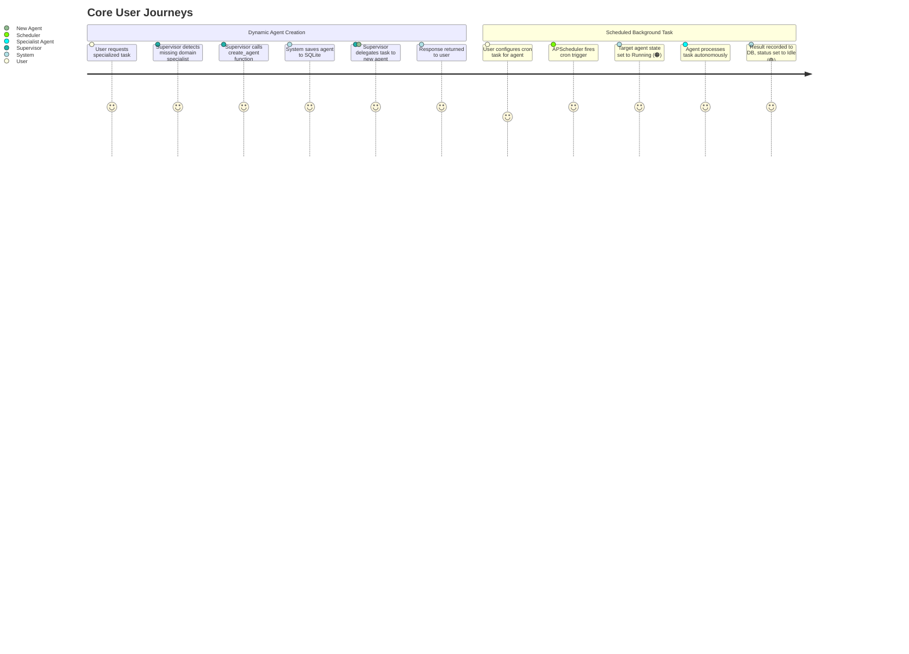

# Product Requirements Document (PRD)
## Project: Autonomous Multi-Agent System (MAS) & Visual Control Plane

### 1. Executive Summary & Vision
The **Autonomous Multi-Agent System (MAS)** is a local, self-contained AI platform inspired by the autonomy, delegation, and responsiveness of "Grok". The system combines a dynamic **Supervisor-Worker multi-agent network** built with LangGraph, a robust **FastAPI backend**, an **SQLite persistence engine**, and a high-fidelity **Streamlit visual control plane**.

The platform is designed to operate seamlessly within the free-tier constraints of Google AI Studio (Gemini 1.5 Pro / Flash), incorporating strict client-side rate-limiting (15 Requests Per Minute), dynamic agent synthesis, resilient multi-agent collaboration, and autonomous scheduled background jobs.

---

### 2. User Personas & Core Use Cases
- **Autonomous Operations Engineer:** Wants background cron-style agents executing scheduled tasks (e.g., periodic data scraping, market monitoring, system health checks, daily synthesis reports) without human intervention.
- **Power User / Researcher:** Interacts with a single conversational interface (Supervisor) that automatically understands requirements, creates specialized agents on the fly, and coordinates delegation among them.
- **AI Systems Architect:** Requires visibility into agent operational states (Idle, Thinking/Running, Error), conversation logs, and background job metrics in real time via a clean visual dashboard.

---

### 3. Key Feature Specifications

#### 3.1. Dynamic Agent Spawning
- **Intent Recognition:** The Supervisor Agent evaluates user prompts. If a task requires a specialized domain capability not currently handled by existing agents, the Supervisor triggers a structured function call (`create_agent`).
- **Agent Registry:** Dynamically generated agents are assigned a unique identifier, name, slug, role description, and a tailored system prompt.
- **Persistence:** Newly spawned agents are immediately committed to the SQLite database and become hot-swappable in the LangGraph supervisor routing table and Streamlit UI without requiring a server reboot.
- **Manual Spawning:** Users can also explicitly define and instantiate custom agents through the Streamlit Control Plane interface.

#### 3.2. Visual Control Plane (Streamlit Dashboard)
- **Left Sidebar - Agent Registry & Status Monitor:**
  - Displays all registered agents with real-time status indicators:
    - 🟢 **Idle**: Agent is registered, warm, and ready for work.
    - 🟠 **Thinking / Running**: Agent is actively invoking LLMs or tools.
    - 🔴 **Error / Backoff**: Agent encountered a failure or is cooling down due to rate-limiting.
  - Displays active background tasks and system rate-limit quotas (requests remaining in current 60s window).
- **Main View - Multi-Mode Control Plane:**
  - **Mode 1: Multi-Agent Chat Console**:
    - Select between chat with the **Supervisor** (delegated orchestrator) or direct 1-on-1 interaction with any registered specialist agent.
    - Message history preserved in SQLite per session.
    - Visual display of delegation tags (e.g., `[Supervisor -> MarketResearcher]: Delegating search query...`).
  - **Mode 2: Background Task Scheduler**:
    - Form to create, inspect, pause, and delete recurring (cron) or one-shot scheduled tasks.
    - Target agent assignment, input prompt, schedule expression (cron or interval in seconds/minutes), and execution history log.
  - **Mode 3: Agent Management & Forge**:
    - Review, edit, or delete dynamically spawned agents and their system prompts.

#### 3.3. Autonomy & Agent-to-Agent Delegation
- **LangGraph Supervisor Architecture**:
  - The Supervisor node inspects the incoming request, inspects active agents in the registry, and emits a structured routing decision.
  - Agents can communicate sequentially or hierarchically: Agent A can produce an artifact, pass control back to Supervisor or directly delegate follow-up analysis to Agent B.
  - Graph terminates cleanly with a synthesized response to the user.
- **Autonomous Triggers**:
  - Background scheduler invokes agent pipelines without active UI sessions.
  - Completed autonomous runs log results to the database and write notifications to the dashboard event feed.

#### 3.4. Rate-Limit Resilience (Gemini Free Tier 15 RPM)
- **Sliding-Window / Token-Bucket Rate Limiter**:
  - Google AI Studio imposes a 15 RPM limit on free-tier API keys.
  - The system enforces a strict local client-side limiter: max 14 calls per rolling 60-second window (leaving a 1-request buffer).
- **Exponential Backoff & Queueing**:
  - Agent LLM calls are queued asynchronously.
  - Any 429 (ResourceExhausted) response triggers exponential backoff with jitter (initial retry 5s, doubling up to 60s) via `tenacity`.
  - The UI visually flags rate-limit waits so the user is never left wondering why an agent is paused.

---

### 4. Non-Functional & Infrastructure Requirements
- **Zero-Cost Footprint:** Operates under zero-cost infrastructure limits: SQLite for storage, Google AI Studio free tier (Gemini 1.5 Flash/Pro), Google Cloud Run free tier for backend/agents, and Streamlit Community Cloud for frontend.
- **Containerization & Local Orchestration:** Fully containerized using Docker and `docker-compose.yml` for unified local setup with hot-reloading and health checks.
- **Persistent State Management:** Dedicated Docker volume mounts (`mas_sqlite_data`) locally and Google Cloud Storage FUSE / Litestream in Cloud Run guarantee that the agent registry, chat history, and task schedules persist across container lifecycle events.
- **Python Modernity:** Python 3.11+ using native type hints, async/await everywhere for I/O and background jobs.
- **Graceful Shutdown & Data Integrity:** Database transactions ensure atomic operations for agent creation and task scheduling. SQLite WAL (Write-Ahead Logging) mode enabled for concurrent read/write support.
- **Extensibility:** Tool calling architecture allows plugging in Python functions (e.g., Web Search, File I/O, Calculator) as agent tools.

---

### 5. User Flows

---

### 6. Acceptance Criteria
| ID | Requirement | Verification Method |
|:---|:---|:---|
| **AC-01** | Dynamic Agent Creation via LLM | Prompting Supervisor "I need an expert in Python security auditing" automatically spawns `SecurityAuditor` and registers it in SQLite. |
| **AC-02** | Manual Agent Management | User can add, edit, or delete an agent through the Streamlit Agent Forge tab. |
| **AC-03** | Agent Status Display | Agent status updates in real-time (🟢 Idle -> 🟠 Running -> 🟢 Idle) in the Streamlit sidebar. |
| **AC-04** | Agent-to-Agent Delegation | Supervisor successfully routes a multi-step query to at least one worker agent and aggregates the output. |
| **AC-05** | Background Task Execution | APScheduler runs a scheduled prompt on a 1-minute interval, writes output to `task_runs`, without user interaction. |
| **AC-06** | 15 RPM Rate Limiting | Firing 20 rapid queries in a loop does not crash the app with 429; calls are throttled and executed within quota. |
| **AC-07** | Session & History Persistence | Restarting FastAPI / Streamlit restores all agents, tasks, and chat history from SQLite. |
| **AC-08** | Docker Compose Orchestration | Running `docker compose up --build` brings up both backend and frontend with healthy status and persistent volume mounting. |
| **AC-09** | Cloud Run & Streamlit Cloud Ready | Container images build cleanly and support zero-cost deployment to Google Cloud Run and Streamlit Community Cloud. |

